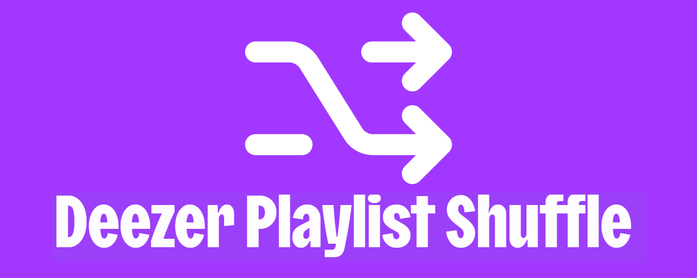

Shuffle your Deezer playlists without hassle 🤷🏻‍♂️

# Start
1. Clone the repository
2. Run `npm install`
3. Run `npm start`. It will watch changes and build two files; `content.js` and `popup.js`.

# Build
1. Run `npm run build`. It will build two files for production; `content.js` and `popup.js`.

# Zip
1. Run `npm run zip`. This step also runs `npm run build` before zipping the files.
